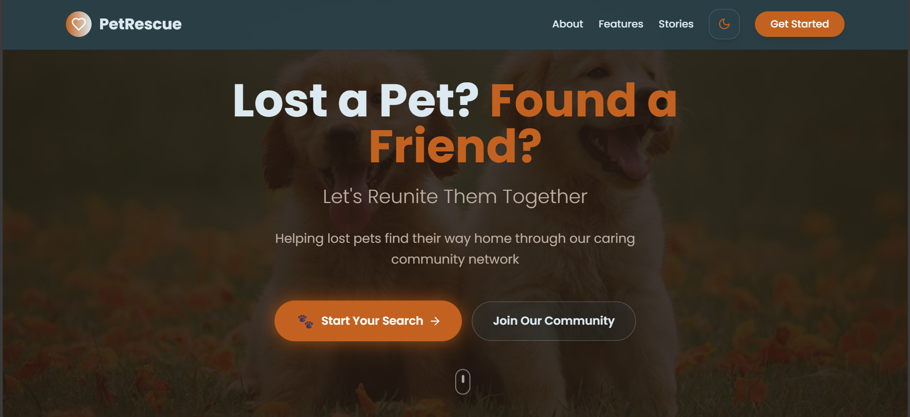

# Pet Rescue and Adoption Management Portal 🐾

Welcome to the Pet Rescue and Adoption Management Portal, a full-stack web application developed as a project during the 8-week **Infosys Springboard Virtual Internship 6.0**. The project began on August 13th, 2025.

The primary goal of this platform is to simplify the process of reuniting lost pets with their owners and to facilitate pet adoptions. It acts as a centralized and structured portal to bridge the communication gap between pet finders, owners, and administrators.

---

## 📸 Screenshots

Here is a look at the application's interface.

### Main Interface
| Homepage | Chatbot |
| :---: | :---: |
|  |  |

### Dashboards
| User Dashboard | Admin Dashboard |
| :---: | :---: |
|  |  |

---

## ✨ Key Features

The platform is built with the following core modules and features:

* **👤 User Management:** Includes secure user registration and login modules to manage user profiles and authenticate requests.
* **📝 Pet Reporting:** Allows users to submit detailed reports for lost or found pets, including type, breed, color, location, and photos.
* **💬 Chatbot Support:** An interactive chatbot to answer user queries, address pet-related doubts, and provide suggestions.
* **🛠️ Admin Dashboard:** Provides administrators with a dashboard to view, verify, and update the status of pet reports (e.g., "Accepted," "Rejected," "Pending") to effectively connect finders with owners.
* **🔍 Pet Status Inquiry and Search:** A robust search feature allows users to check if their missing pet is listed in the system.
* **🔔 Notifications:** An integrated notification system provides timely updates to both users and administrators regarding the status of their requests.
* **🏆 Reward System:** A version of the project was designed with a reward-based mechanism to encourage community participation in rescuing and adopting pets.

---

## 🛠️ Technology Stack

The portal was built using a modern, full-stack architecture:

* **Frontend:** The user interface was developed using HTML, CSS, React.js, Vite, TypeScript, and Tailwind CSS.
* **Backend:** The server-side logic and APIs were built with Django and Django Rest Framework (Python).
* **Database:** The system uses PostgreSQL for secure and structured data management.
* **Tools:** Development and testing were supported by Postman for API testing and Git/GitHub for version control.

---

## 🚀 Getting Started

To get a local copy up and running, follow these simple steps.

### Prerequisites

Make sure you have the following installed on your machine:
* Git
* Python 3.8+ and Pip
* Node.js and npm
* PostgreSQL

### Installation & Setup

1.  **Clone the repository:**
    ```sh
    git clone https://github.com/adityakumar-09/pet-rescue.git
    ```

2.  **Backend Setup:**
    ```sh
    # Navigate to the backend directory
    cd backend

    # Create and activate a virtual environment
    python -m venv venv
    venv/Scripts/activate

    # Install the required Python packages
    pip install -r requirements.txt
    ```

3.  **Frontend Setup:**
    ```sh
    # Navigate to the frontend directory from the root
    cd frontend

    # Install the required npm packages
    npm install
    ```

4.  **Environment Variables & Database:**
    * Set up a PostgreSQL database for the project.
    * Create a `.env` file in the `/backend/pet_rescue_pro` directory. Add your database connection URL, secret key, and other environment variables.
        ```ini
        # Example .env file in /backend/pet_rescue_pro
        # Django secret key
        SECRET_KEY=<secret key>

        # Debug mode (set False in production)
        DEBUG=True

        # Allowed hosts
        ALLOWED_HOSTS=127.0.0.1,localhost

        # Database settings
        DB_NAME=<database name>
        DB_USER=<username>
        DB_PASSWORD=<password>
        DB_HOST=localhost
        DB_PORT=5432

        # Gmail SMTP settings
        EMAIL_HOST_USER=<email for SMTP>
        EMAIL_HOST_PASSWORD=<password>


        GOOGLE_API_KEY=<google api key>
        ```

5.  **Run the Application:**
    * **Start the Backend Server** (from the `/backend/pet_rescue_pro` directory):
        ```sh
        # Apply database migrations
        python manage.py migrate

        # Run the server
        python manage.py runserver
        ```
    * **Start the Frontend Development Server** (from the `/frontend` directory in a new terminal):
        ```sh
        npm run dev
        ```
    Your application should now be running locally!

---

## 🤝 Contributors

This project was a collaborative effort by the members of Batch 01.

* Aditya Kumar
* Aditya Tiwari
* Mere Venkat Gopi Krishna
* Arvind Puvvada
* Divyanshu Ranjan
* Paidi Harika
* Sadagopan T
* Sindhu Narahari
* Harsh Mandloi
* Sirgadha BhanuPrakash
* Ramya Thangadurai
* Prasanna Murru
* Dama Ramya Sree
* Chollangi Meghanaharini
* Sona.V
* Keerthika Senthil Kumar
* Yatharth Vashisht
* Harshavarthini M
* Prajwal Kulkarni
* Kalaiselvan R
* Kandhi Bhanu
* Himanshu Nishad
* Vishal Kumar Roy
* Gayathri Jeyachandran
* Rakshitha G.

---

## 🙏 Acknowledgements

Sincere gratitude is extended to everyone who supported this internship journey.

* **Infosys Springboard** for providing this valuable virtual internship opportunity to work on a meaningful project.
* Our mentor, **Sri Lalitha L**, for her continuous guidance, valuable feedback, and encouragement.
* Our coordinator, **Mahalakshmi G.R**, for overseeing the program and providing consistent support.
* All team members for their collaboration, hard work, and supportive spirit that made the project's success possible.
